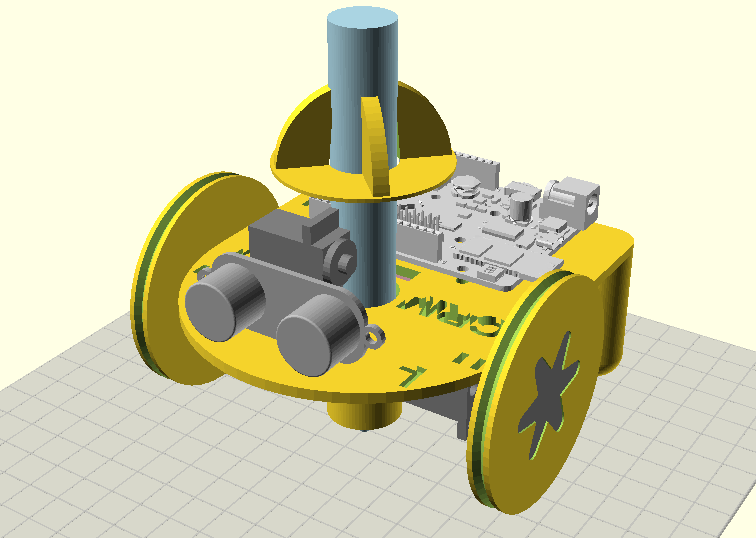

Phogo 3D-printable design
=

Here you can find the [OpenScad](http://www.openscad.org/) source files for the Phogo mechanic parts.  
You may want to read the **[Bill of Materials & assembly guide](https://github.com/CRM-UAM/Phogo/wiki/Assembly-guide)** in the wiki.

  
