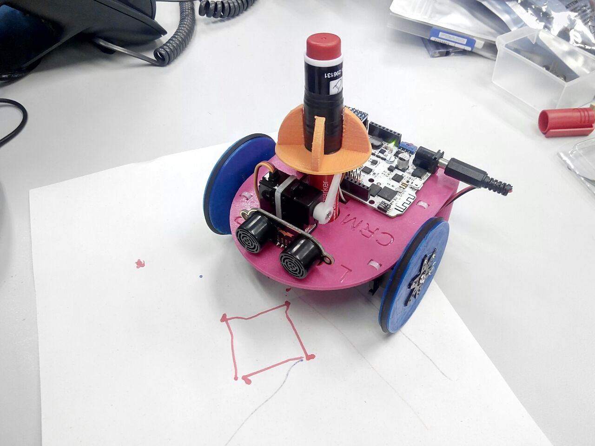

# Phogo

Phogo is an educational project to learn how to program. It is based in the [Logo](https://en.wikipedia.org/wiki/Logo_(programming_language)) programming language (and its turle), created in 1967 by Seymour Papert and other researchers.

_Phogo es un proyecto educativo para aprender a programar basado en el lenguaje de programación [Logo](https://en.wikipedia.org/wiki/Logo_(programming_language)) (y su tortuga) creado en 1967 por Seymour Papert y otros investigadores._

You can find more information in the [project's wiki page](https://github.com/CRM-UAM/Phogo/wiki). Couldn't find what you were looking for? [Contact us](https://github.com/CRM-UAM/Phogo/issues/new).

_Toda la información está en la [wiki del proyecto](https://github.com/CRM-UAM/Phogo/wiki). ¿No encuentras algo? [Contacta con nosotros](https://github.com/CRM-UAM/Phogo/issues/new)._

  
Phogo robot proudly drawing a small square. _Robot Phogo dibujando un pequeño cuadrado._

  
3D-printable CAD robot design. Find it in [[3D_design]]. _Diseño CAD imprimible en 3D. Puedes encontrarlo en [[3D_design]]_

License
=

All of the Phogo source code is released under the [GNU General Public License Version 3](http://www.gnu.org/licenses/gpl-3.0.html).  
The rest of elements such as text, images or manuals are published under the [CC BY-SA 4.0 license terms](https://creativecommons.org/licenses/by-sa/4.0/).  

Todo el código fuente de Phogo está publicado bajo una licencia [GNU General Public License Version 3](http://www.gnu.org/licenses/gpl-3.0.html).  
El resto de elementos como textos, imágenes o manuales bajo una licencia [CC BY-SA 4.0](https://creativecommons.org/licenses/by-sa/4.0/).  

Authors
=

- Pablo Molins Ruano (@molins)
- Carlos Gonzalez Sacristán (@ChacheGS)
- Carlos García Saura (@CarlosGS)

